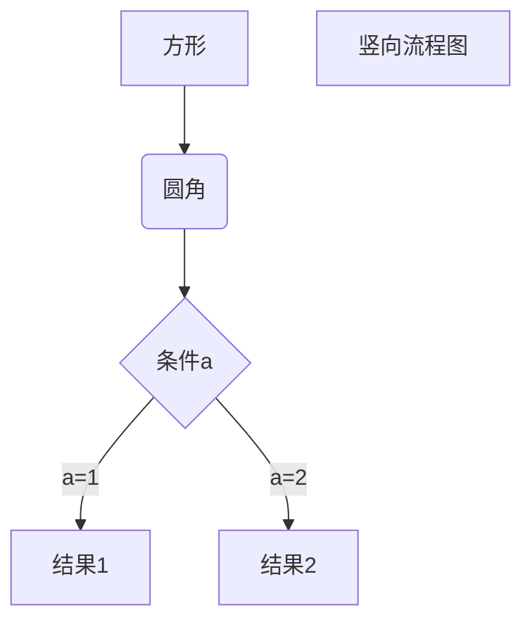

# 动态规划

## 这是啥

参考百度百科:

**动态规划**(Dynamic Programming, DP)是:

- **数学**的二级学科**运筹学**下的三级学科
- 求解**多阶段决策过程最优化**的过程, 是一种数学方法, 并没有统一的处理方法 (但有套路)
- 每个阶段的决策依赖当前状态, 而又会引起状态转移, 故称"动态"
- 兄弟姐妹有 *线型规划* 、*非线型规划*、*组合最优化*、*图论*等

## 能干啥

~~运筹帷幄~~

应用广泛, 如经济、工业、军事等领域, 并在背包问题、生产经营问题、资金管理问题、资源分配问题、最短路径问题和复杂系统可靠性问题等中取得了显著的效果

这里只讨论编程领域的应用

## 怎么干

### 基本思想

与分治法类似 (如快速/归并排序算法), 将待求解问题分为若干子问题, 从子问题的解得到原问题的解, 这是自顶向下递归求解, 图示如下:

```echarts
{
  width: 500,
  height: 400,
  xAxis: {
      type: 'category',
      data: ['Mon', 'Tue', 'Wed', 'Thu', 'Fri', 'Sat', 'Sun']
  },
  yAxis: {
      type: 'value'
  },
  series: [
    {
      data: [820, 932, 901, 934, 1290, 1330, 1320],
      type: 'line'
    }
  ]
}
```

```flowchart
st=>start: Start:>http://www.google.com[blank]
e=>end:>http://www.google.com
op1=>operation: My Operation
sub1=>subroutine: My Subroutine
cond=>condition: Yes
or No?:>http://www.google.com
io=>inputoutput: catch something...
para=>parallel: parallel tasks

st->op1->cond
cond(yes)->io->e
cond(no)->para
para(path1, bottom)->sub1(right)->op1
para(path2, top)->op1
```


