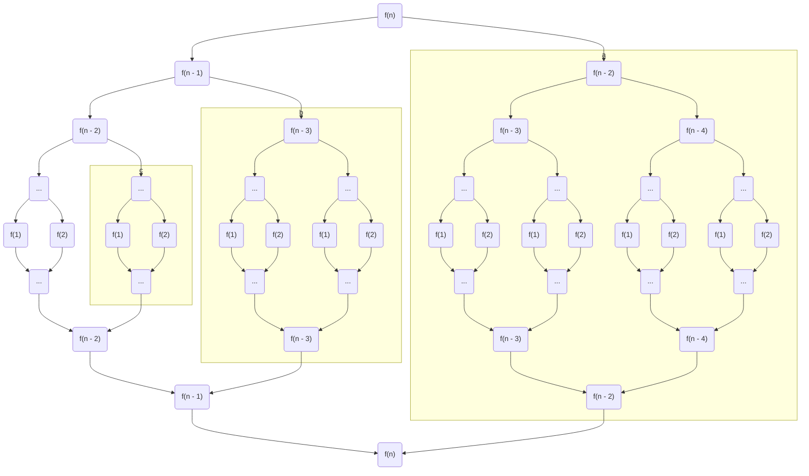
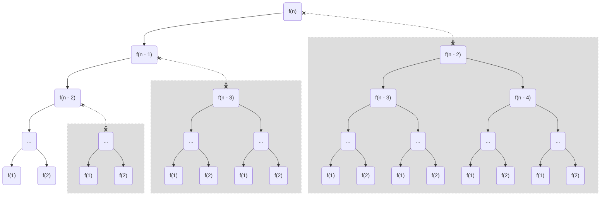
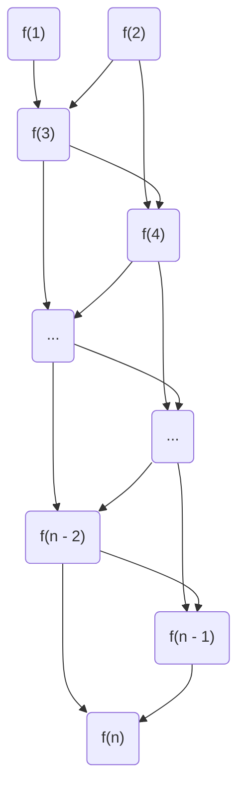
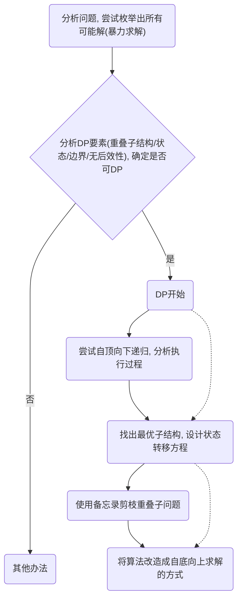
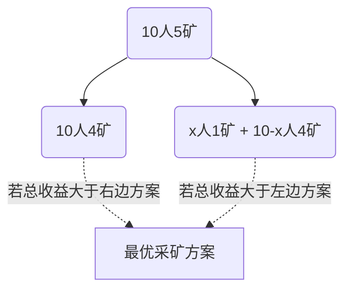
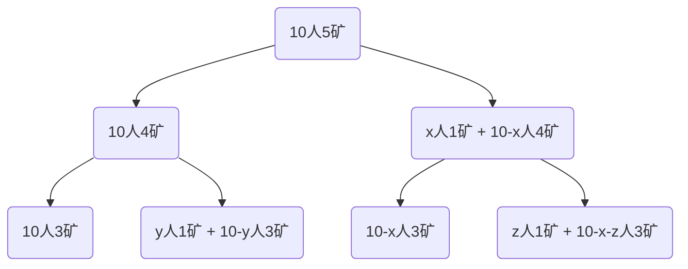

# 动态规划

## 这是啥

参考百度百科 :wink: :

**动态规划**(Dynamic Programming, DP)是:

- **数学**的二级学科**运筹学**下的三级学科
- 求解**多阶段决策过程最优化**的过程, 是一种数学方法论, 没有公式可套 (但有套路)
- 每个阶段的决策依赖当前状态, 而又会引起状态转移, 故称"动态"
- 兄弟姐妹有 *线型规划* 、*非线型规划*、*组合最优化*、*图论*等

## 能干啥

~~主持大菊, 运筹帷幄~~

应用广泛, 如经济、工业、军事等领域, 并在背包问题、生产经营问题、资金管理问题、资源分配问题、最短路径问题和复杂系统可靠性问题等中取得了显著的效果...

::: tip 画重点
这里只讨论编程领域的应用
:::

## 怎么干

### 基础概念

_(做出决策 = 计算出结果)_

- 状态: 当前阶段上下文
- 边界: 无法继续优化的阶段, 即决策确定 _(无边界 = 无解/无数解 = 死循环)_
- 无后效性: 当前阶段做出决策后, 后续决策 不受 之前阶段 的影响, 即状态单向转移, 后续决策都是基于前面有限的阶段
- 状态转移方程: 不同阶段间上下文关系
- 重叠子结构: 不同阶段之间要解决的若干问题有重复
- 备忘录(DP Table): 在寻找最优子结构, 化简状态转移方程的过程中用于记录各阶段状态或决策的额外数据, 应该尽量去掉
- 最优子结构: 对阶段的划分和决策的过程最优化, 最优子结构一定也是由最优子结构组成

## 举例子

与分治法类似 (如快速/归并排序算法), 都是将待求解问题分为若干子问题, 从子问题的解得到原问题的解, 大事化小, 小事化了. 不同的是分治法一般是**自顶向下**递归求解, 而动态规划优化后一般是**自底向上**求解

以求解 斐波那契数列 第 `n` 位的值为例

问题分析:thinking:: 斐波那契数列 前两位为 `1`， 之后的每一位的值等于它前面两位的和

:bulb::sparkles: 暴力求解无脑走一波(自顶向下)

### 普通递归算法 :thumbsdown:

```TypeScript{2}
function fibonacci(n: number): number {
  return n < 3 ? 1 : fibonacci(n - 1) + fibonacci(n - 2)
}
```

求解过程如下:



如图所示, 圈起来的都是重复子问题, 可以通过使用备忘录空间换时间的方式来实现剪枝

### 带备忘录递归算法 :thumbsup:

```TypeScript{6}
let DPTable: { [key: number]: number }

function solve(n: number): number {
  return (
    DPTable[n] ||
    (DPTable[n] = n < 3 ? 1 : solve(n - 1) + solve(n - 2))
  )
}

function fibonacci(n: number): number {
  DPTable = {}
  const result = solve(n)
  DPTable = null! // 睁一只眼闭一只眼

  return result
}
```

### 动态规划算法 :heart_eyes::call_me_hand:

我们应用动态规划的概念来审视上面的解法

- 状态: `n`的值
- 重叠子结构: 上图框起来的部分, 比如 `f(n - 2)` 计算了两次, `f(n - 3)` 计算了三次...
- 备忘录: 使用一个简单对象(这里也可以是数组)缓存每个阶段计算结果
- 最优子结构: 对于 `n > 2` 存在最优子结构, 如下图:



- 边界: `n = 1 或 2`
- 无后效性: `n > 2` 的每个阶段的结果**完全取决于**它前面两个阶段的结果
- 状态转移方程: 易得(已最简): $f(n) = \begin{cases}
   1 & n = 1, n = 2 \\
   f(n - 1) + f(n - 2) & n > 2
\end{cases}$

所以这么一波分析之后, 找到最优的求解过程应该如下



顺着备忘录的思路根据**状态转移方程**改为**自底向上**求解的形式:

```TypeScript
function fibonacci(n: number) {
  const DPTable: { [key: number]: number } = { 1: 1, 2: 1 }

  for (let i = 3; i <= n; i++) {
    DPTable[i] = DPTable[i - 1] + DPTable[i - 2]
  }

  return DPTable[n]
}
```

很明显备忘录是可以优化掉的, 易得:

```TypeScript
function fibonacci(n: number) {
  let prev = 1
  let curr = 1
  let next
  while (n-- > 2) {
    next = prev + curr
    prev = curr
    curr = next
  }

  return curr
}
```

### 对比

*TODO: 时间/空间复杂度*

```echarts
{
    tooltip: {
        trigger: 'axis',
        axisPointer: {
            type: 'cross',
            crossStyle: {
                color: '#999'
            }
        }
    },
    xAxis: [
        {
            type: 'category',
            data: ['普通递归', '带备忘录递归', '带备忘录动态规划', '动态规划'],
            axisPointer: {
                type: 'shadow'
            }
        }
    ],
    yAxis: [
        {
            type: 'value',
            name: '时间复杂度',
            axisLabel: {
                formatter: 'O({value}}'
            }
        },
        {
            type: 'value',
            name: '空间复杂度',
            axisLabel: {
                formatter: 'O({value})'
            }
        }
    ],
    series: [
        {
            name: '时间复杂度',
            type: 'bar',
            data: [2.0, 4.9, 7.0, 23.2]
        },
        {
            name: '空间复杂度',
            type: 'bar',
            yAxisIndex: 1,
            data: [2.6, 5.9, 9.0, 26.4]
        }
    ]
}
```

## 讲套路

上面的示例只是体现了动态规划的一般过程, 动态规划是一种求解**最值**的方法论, 它的核心是**尽可能压缩可能解空间**, 具体做法是将大问题拆解为若干小问题, 求解小问题推导出大问题的解。

设计动态规划算法主要思路为:

- 明确状态, 搞清楚当前面对的问题
- 分析上游状态, 弄明白要解决当前阶段的问题最直接的需求
- 跟踪下游状态, 对当前问题的解决是否满足对下游的需求

上下游情况考虑清楚一个, 往往就能设计出状态转移方程. 从求解一个问题开始, 一般的解决过程如下:



## 做练习


::: warning 黄金矿工
有**5座**储量不尽相同的金矿, 每座金矿需要的矿工人数也不尽相同(如下表), 现有矿工**10位**, 每座金矿只能挖光或不挖, 不能只投入一部分人挖走部分金矿。求利益最大化方案(挖到最多金子)
:::

| 金矿 | 金矿A | 金矿B | 金矿C | 金矿D | 金矿E |
|:----:|:----:|:----:|:----:|:----:|:----:|
| 储量(kg) | 400 | 500 | 200 | 300 | 350 |
| 需要的矿工数 | 5 | 5 | 3 | 4 | 3 |

### 问题分析

穷举: 每座矿只有挖或不挖两种情况, 故挖矿方案共有 `@sum_(n=1)^5 C_5^n@` 种, 从中找出投入不超过10位矿工并且获得金矿最多的方案即可, 算法实现的时间复杂度为 `@O(2^n)@` (空间复杂度`@O(n)@`, 金矿全都挖的时候)

尝试DP (以下 "x位矿工挖n座矿的最优方案" 简称 "x人n矿")

分解问题:



:wink:发现动态规划要素了没？

继续分解看看:



若设金矿数量为 `goldMineCount` , 矿工数为 `minerCount`, 金矿储量依次为 `reserves[]` , 金矿用工数依次为 `requiredMiners[]` , 则`10人5矿`可以表示为:
$$
f(10, 5) = max(f(10, 4), reserves[4] + f(10 - requiredMiners[4], 4))
$$

递推下去这个问题会有边界么? 显然存在, 如下:
$$
f(x, 1) = \begin{cases}
  reserves[0] & x >= requiredMiners[0] \\
  0 & x < requiredMiners[0]
\end{cases}
$$

所以这个问题是可以用动态规划方法解决的:v:

由上可得状态转移方程如下:

$$
f(minerCount, goldMineCount) = \begin{cases}
  0 & goldMineCount <= 1 \& \\ & \quad minerCount < requiredMiners[0] \\
  reserves[0] & goldMineCount = 1 \& \\ & \quad minerCount >= requiredMiners[0] \\
  f(minerCount, goldMineCount - 1) & goldMineCount > 1 \& \\ & \quad minerCount < requiredMiners[goldMineCount - 1] \\
  max( & goldMineCount > 1 \& \\
    \quad f(minerCount, goldMineCount - 1), & \quad minerCount >= requiredMiners[goldMineCount - 1] \\
    \quad reserves[goldMineCount - 1] + \\
    \qquad f( \\
    \qquad\quad minerCount - requiredMiners[goldMineCount - 1], \\
    \qquad\quad goldMineCount - 1 \\
    \qquad ) \\
  )
\end{cases}
$$

那么DP走起, `f(minerCount, goldMineCount)` 备忘录如下:

|**minerCount / goldMineCount**|**1**|**2**|**3**|**4**|**5**|
|:----:|:----:|:----:|:----:|:----:|:----:|
|**1**|0|0|0|0|0|
|**2**|0|0|0|0|0|
|**3**|0|0|200<br/>*(C)*|200<br/>*(C)*|350<br/>*(E)*|
|**4**|0|0|200<br/>*(C)*|300<br/>*(D)*|350<br/>*(E)*|
|**5**|400<br/>*(A)*|500<br/>*(B)*|500<br/>*(B)*|500<br/>*(B)*|500<br/>*(B)*|
|**6**|400<br/>*(A)*|500<br/>*(B)*|500<br/>*(B)*|500<br/>*(B)*|550<br/>*(C + E)*|
|**7**|400<br/>*(A)*|500<br/>*(B)*|500<br/>*(B)*|500<br/>*(B) / (C + D)*|650<br/>*(D + E)*|
|**8**|400<br/>*(A)*|500<br/>*(B)*|700<br/>*(B + C)*|700<br/>*(B + C)*|850<br/>*(B + E)*|
|**9**|400<br/>*(A)*|500<br/>*(B)*|700<br/>*(B + C)*|800<br/>*(B + D)*|850<br/>*(B + E)*|
|**10**|400<br/>*(A)*|900<br/>*(A + B)*|900<br/>*(A + B)*|900<br/>*(A + B)*|900<br/>*(A + B)*|
|**11**|400<br/>*(A)*|900<br/>*(A + B)*|900<br/>*(A + B)*|900<br/>*(A + B)*|1050<br/>*(B + C + E)*|
|**12**|400<br/>*(A)*|900<br/>*(A + B)*|900<br/>*(A + B)*|1000<br/>*(B + C + D)*|1150<br/>*(B + D + E)*|
|**13**|400<br/>*(A)*|900<br/>*(A + B)*|1100<br/>*(A + B + C)*|1100<br/>*(A + B + C)*|1250<br/>*(A + B + E)*|
|**14**|400<br/>*(A)*|900<br/>*(A + B)*|1100<br/>*(A + B + C)*|1200<br/>*(A + B + D)*|1250<br/>*(A + B + E)*|
|**15**|400<br/>*(A)*|900<br/>*(A + B)*|1100<br/>*(A + B + C)*|1200<br/>*(A + B + D)*|1350<br/>*(B + C + D + E)*|
|**16**|400<br/>*(A)*|900<br/>*(A + B)*|1100<br/>*(A + B + C)*|1200<br/>*(A + B + D)*|1450<br/>*(A + B + C + E)*|
|**17**|400<br/>*(A)*|900<br/>*(A + B)*|1100<br/>*(A + B + C)*|1400<br/>*(A + B + C + D)*|1550<br/>*(A + B + D + E)*|
|**18**|400<br/>*(A)*|900<br/>*(A + B)*|1100<br/>*(A + B + C)*|1400<br/>*(A + B + C + D)*|1550<br/>*(A + B + D + E)*|
|**19**|400<br/>*(A)*|900<br/>*(A + B)*|1100<br/>*(A + B + C)*|1400<br/>*(A + B + C + D)*|1550<br/>*(A + B + D + E)*|
|**20**|400<br/>*(A)*|900<br/>*(A + B)*|1100<br/>*(A + B + C)*|1400<br/>*(A + B + C + D)*|1750<br/>*(A + B + C + D + E)*|

::: tip 提示
后文中将省略已出现过的代码
:::

### 递归形式

只计算最大收益数值:

```TypeScript
/** 金矿信息 */
interface GoldMine {
  /** 黄金储量 */
  gold: number
  /** 需要矿工数 */
  cost: number
}

function getMostGold<T extends GoldMine = GoldMine>(
  goldMines: T[],
  minerCount: number,
  goldMineCount = goldMines.length
): number {
  if (goldMineCount < 2) {
    const goldMine = goldMines[0]

    return minerCount < goldMine.cost ? 0 : goldMine.gold
  }

  const goldMine = goldMines[--goldMineCount]
  const right =
    minerCount < goldMine.cost
      ? 0
      : minerCount === goldMine.cost
        ? goldMine.gold
        : goldMine.gold +
          getMostGold(goldMines, minerCount - goldMine.cost, goldMineCount)

  const left = getMostGold(goldMines, minerCount, goldMineCount)

  return left > right ? left : right
}

/* 验证
getMostGold(
  [
    { id: '1', gold: 400, cost: 5 },
    { id: '2', gold: 500, cost: 5 },
    { id: '3', gold: 200, cost: 3 },
    { id: '4', gold: 300, cost: 4 },
    { id: '5', gold: 350, cost: 3 },
  ],
  10
)
*/
```

得到详细方案:

```TypeScript
/** 得到黄金最多的 采矿方案 */
interface Plan<T extends GoldMine = GoldMine> extends GoldMine {
  /** 要挖掘的金矿 */
  mines: T[]
}

function addTo(goldMine: GoldMine, plans: Plan[]) {
  let plan
  let i = plans.length
  const { gold, cost } = goldMine

  while (i--) {
    plan = plans[i]

    plan.gold += gold
    plan.cost += cost
    plan.mines.push(goldMine)
  }
}
function defaultCompare(a: any, b: any) {
  return a === b
}
function sameArray<T extends any = any, R extends any = T>(
  arrayA: T[] | readonly T[] | undefined,
  arrayB: R[] | readonly R[] | undefined,
  ignoreOrder?: boolean,
  sameItem?: (itemInA: T, itemInB: R) => boolean
) {
  if (arrayA === arrayB) {
    return true
  }

  if (!arrayA || !arrayB) {
    return false
  }

  const size = arrayA.length

  if (size !== arrayB.length) {
    return false
  }

  sameItem || (sameItem = defaultCompare)
  for (let i = 0, j, item, isDiffer; i < size; i++) {
    item = arrayA[i]
    isDiffer = !sameItem(item, arrayB[i])

    if (ignoreOrder && isDiffer) {
      for (j = 0; j < size; j++) {
        if (j !== i && sameItem(item, arrayB[j])) {
          isDiffer = false
          break
        }
      }
    }

    if (isDiffer) {
      return false
    }
  }

  return true
}
function samePlan(planA: Plan, planB: Plan) {
  return (
    planA === planB ||
    (planA.gold === planB.gold &&
      planA.cost === planB.cost &&
      sameArray(planA.mines, planB.mines))
  )
}
function merge<T extends GoldMine = GoldMine, R extends GoldMine = T>(
  leftPlans: Plan<T>[],
  rightPlans: Plan<R>[]
): Plan<T | R>[] {
  let leftValue = leftPlans[0].gold
  let rightValue = rightPlans[0].gold

  if (leftValue === rightValue) {
    // 归并
    let l = leftPlans.length
    let r = rightPlans.length
    let p = l + r
    const mergedPlans = Array<Plan<T | R>>(p)

    let leftPlan
    let rightPlan
    while (l && r) {
      leftPlan = leftPlans[l - 1]
      rightPlan = rightPlans[r - 1]

      leftValue = leftPlan.cost
      rightValue = rightPlan.cost

      if (leftValue === rightValue) {
        l--
        r--
        mergedPlans[--p] = rightPlan
        sameArray(leftPlan.mines, rightPlan.mines) || (mergedPlans[--p] = leftPlan)
      } else if (leftValue > rightValue) {
        l--
        mergedPlans[--p] = leftPlan
      } else {
        r--
        mergedPlans[--p] = rightPlan
      }
    }

    let compareOnceFlag
    while (l) {
      leftPlan = leftPlans[--l]
      if (
        compareOnceFlag ||
        (compareOnceFlag = !samePlan(leftPlan, mergedPlans[p]))
      ) {
        mergedPlans[--p] = leftPlan
      }
    }
    while (r) {
      rightPlan = rightPlans[--r]
      if (
        compareOnceFlag ||
        (compareOnceFlag = !samePlan(rightPlan, mergedPlans[p]))
      ) {
        mergedPlans[--p] = rightPlan
      }
    }

    mergedPlans.splice(0, p)

    return mergedPlans
  }

  return leftValue > rightValue ? leftPlans : rightPlans
}

function getMostGold<T extends GoldMine = GoldMine>(
  goldMines: T[],
  minerCount: number,
  goldMineCount = goldMines.length
): Plan<T>[] {
  let goldMine
  let cost

  if (goldMineCount < 2) {
    goldMine = goldMines[0]
    cost = goldMine.cost

    return minerCount < cost
      ? [{ gold: 0, cost: 0, mines: [] }]
      : [{ gold: goldMine.gold, cost, mines: [goldMine] }]
  }

  goldMine = goldMines[--goldMineCount]
  cost = goldMine.cost

  if (minerCount < cost) {
    return getMostGold(goldMines, minerCount, goldMineCount)
  }

  let right
  if (minerCount === cost) {
    right = [{ gold: goldMine.gold, cost, mines: [goldMine] }]
  } else {
    right = getMostGold(goldMines, minerCount - cost, goldMineCount)
    addTo(goldMine, right)
  }

  return merge(getMostGold(goldMines, minerCount, goldMineCount), right)
}
```

### 递推(迭代)形式

```TypeScript
function getMostGold<T extends GoldMine = GoldMine>(
  goldMines: T[],
  minerCount: number,
  goldMineCount = goldMines.length
): Plan<T>[] {
  // TODO
}
```

## 留作业

请思考:

1. 动态规划一定比递归更优么?

  *例如矿工数远远大于金矿数的情况;空间/频繁读写敏感场景*

2. 黄金矿工各算法的时间/空间复杂度怎么评估?

  *俺不知道*

## 参考文献

*TODO*
