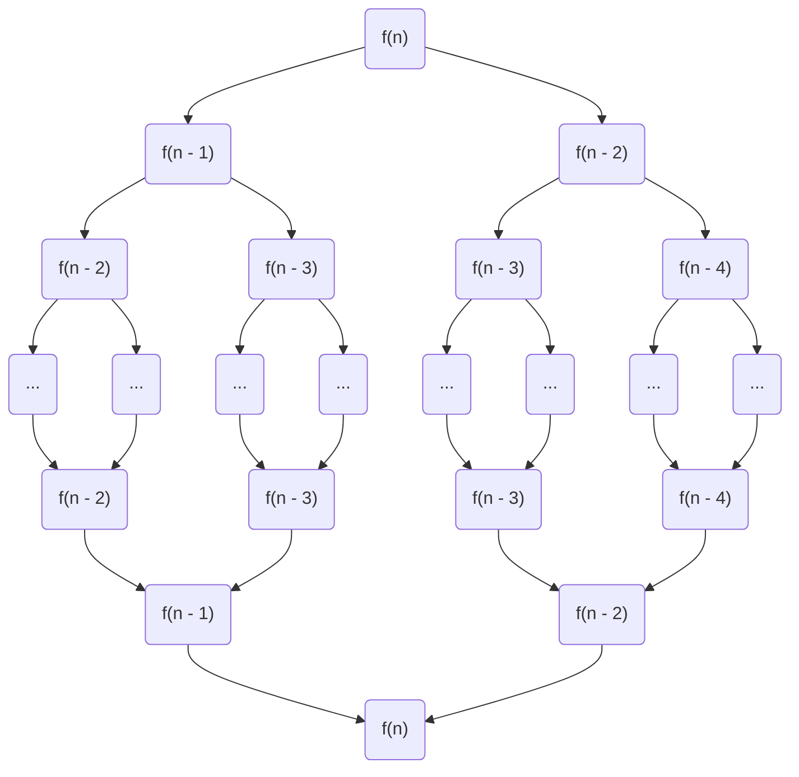

# 动态规划

## 这是啥

参考百度百科:

**动态规划**(Dynamic Programming, DP)是:

- **数学**的二级学科**运筹学**下的三级学科
- 求解**多阶段决策过程最优化**的过程, 是一种数学方法, 并没有统一的处理方法 (但有套路)
- 每个阶段的决策依赖当前状态, 而又会引起状态转移, 故称"动态"
- 兄弟姐妹有 *线型规划* 、*非线型规划*、*组合最优化*、*图论*等

## 能干啥

~~运筹帷幄~~

应用广泛, 如经济、工业、军事等领域, 并在背包问题、生产经营问题、资金管理问题、资源分配问题、最短路径问题和复杂系统可靠性问题等中取得了显著的效果

这里只讨论编程领域的应用

## 怎么干

### 基本思想

与分治法类似 (如快速/归并排序算法), 将待求解问题分为若干子问题, 从子问题的解得到原问题的解, 这是自顶向下递归求解, 一个典型的调用栈(斐波那契数列`@(1/2[1-(1/2)^n])/(1-(1/2))=s_n@`)图示如下:

```AsciiMath
oint_Cx^3 dx+4y^2 dy

2=(((3-x)xx2)/(3-x))

sum_(m=1)^oosum_(n=1)^oo(m^2 n)/(3^m(m3^n+n3^m)
```


